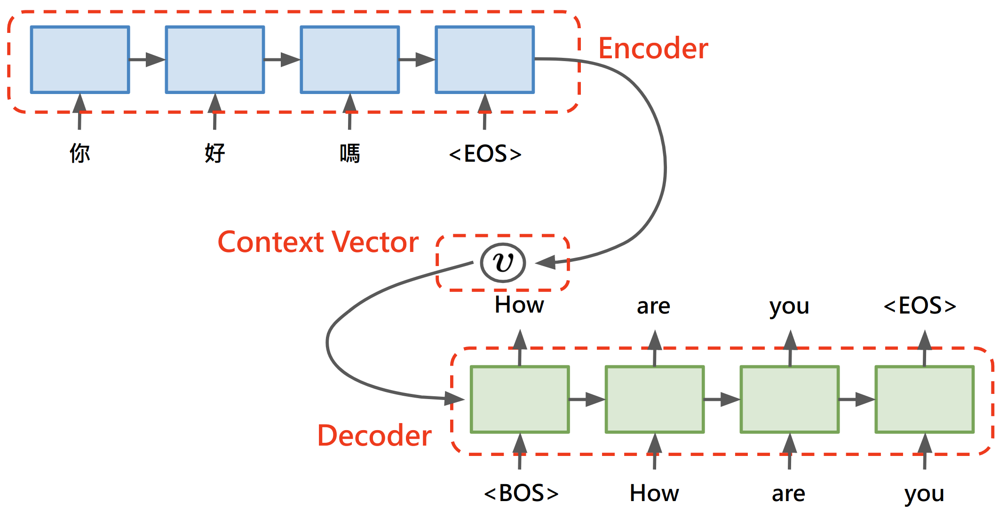
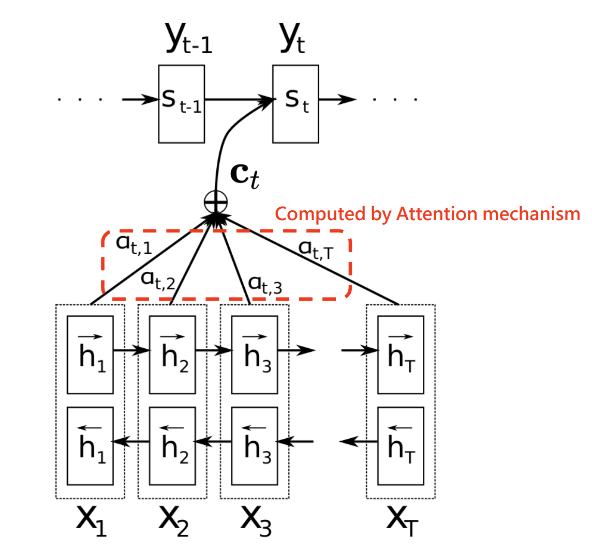

Title: Intro to Attention Mechanism
Date: 2022-02-03 22:08
Author: HsiaoEn
Tags: attention, rnn, seq2seq

>注意力機制(Attention Mechanism)是現今自然語言處理(Natural Language Processing, NLP)領域發展當中重要的一環，**它幫助解決了 RNN 本身記憶力受限的問題**，這樣的機制使得模型在原有 NLP 的任務上表現更好。若是要了解 Attention 的概念，可以從 Seq2Seq Model 說起，了解傳統 Seq2Seq Model 在語言翻譯任務上的侷限性以及在加入 Attention 機制後翻譯效能如何得到改善，這樣的機制不僅可用在語言翻譯任務上，也可用在其它類型的任務以加強原模型的效能，如 QA 等任務。

<!--more-->

因此下面將以 Seq2Seq 做為起始的說明，接著再看到 Attention 如何被帶到 Seq2Seq 的模型之中，最後再來看看關於 Attention 在問答模型(QA)中的應用，以此來比較在不同情境中 Attention 可以如何被利用，以下介紹將基於下面所列的參考文獻做為說明基礎：

* Seq2Seq Model:
    * \[Sutskever, et al. 2014\] [***Sequence to Sequence Learning with Neural Networks***](https://arxiv.org/abs/1409.3215)
    * \[KyungHyun Cho, et al. 2014\] [***Learning Phrase Representations using RNN Encoder-Decoder for Statistical Machine Translation***](https://arxiv.org/abs/1406.1078)
* Basic Attention Mechanism:
    * \[Dzmitry Bahdanau, et al. 2015\] [***Neural Machine Translation by Jointly Learning to Align and Translate***](https://arxiv.org/abs/1409.0473)
* Attention applied in QA Problem
    * \[Cicero dos Santos, et al. 2016\] [***Attentive Pooling Networks***](https://arxiv.org/abs/1602.03609)
    

### **Seq2Seq Model**
我們日常用來溝通的語言，例如「你好嗎？」、「今天天氣不錯！」, 可以被看待成一連串的字詞依照出現時間先後順序所做的排列，也就是時間序列(Time series)。在 NLP 領域中，有一類任務所面對的問題是輸入是一串序列(Input Sequence)：$x_1, x_2, ..., x_S$，目標的輸出也是一串序列(Target Sequence)：$y_1, y_2, ..., y_T$, 而且特別要注意的是這兩個 Sequence 的長度可以不一樣長，例如機器翻譯(Machine Translation, MT)就屬這類的任務之一，對於這樣輸入是 sequence，輸出也是 sequence 的模型我們稱為 Sequence to Sequence Model，或簡寫為 Seq2Seq Model:

     

    <em>Fig. 1. Seq2Seq Model</em>

首先, 對於 Seq2Seq 這樣的任務，一般的 Deep Neural Network 是做不到的(雖然現在有了 Transformer 但目前先不考慮它)，其中一個原因是「順序」對於 Sequence 是有意義的，但是若我們將 Sequence 這樣的資料送進一般的 Deep Nerual Network，模型就只會依據每一次送進模型的資料給出相應的 Output，資料送進模型的順序並不會對 Output 有任何影響，因此要完成 Seq2Seq 這樣的任務就需要用到有循環結構的 RNN 模型。

另一方面，即便考慮了 RNN 模型，我們還是會面對到 Input Sequence: $x_1, x_2, ..., x_S$ 與 Target Sequence: $y_1, y_2, ..., y_T$ 長度不一致的情形。 因此在 *Sequence to Sequence Learning with Neural Networks* 中就提出以下兩個方案來完成 Seq2Seq 的任務：

* 以 LSTM 做為神經網路模型的架構
* 將 Input Sequence: $x_1, x_2, ..., x_S$ 透過 RNN 先 map 到一個固定長度的 vector: $v$，接著再將 $v$ 透過另一個 RNN map 到 Target Sequence: $y_1, y_2, ..., y_T$，如此就能處理 Input Sequence 與 Target Sequence 長度不一致一情形

    

    <em>
        Fig. 2. Seq2Seq Model with RNN structure
    </em>

 

Seq2Seq 模型的架構就如 *Fig. 2.* 所呈現，< BOS > 和 <EOS> 分別表示句子的開始(Begin of Sentence) 和結束(End of Sentence)，整體模型的架構可以拆解為兩個主要的子架構：**Encoder** 和 **Decoder**
* **Encoder**：其功用是把 Input Sequence 壓縮至一個固定長度的 **Context Vector** $v$，因此可以把 $v$ 認定為它夾帶了整個 Input Sequence 必要的資訊。
* **Decoder**：以 Context Vector 及 < BOS > Token 做為 Decoder 的起始輸入，讓 Decoder 參照 Context Vector 等於是讓 Deocder 參照到 Input Sequence 的資訊，以及 < BOS > 只是單純讓 Decoder 開始根據 Context vector 所夾帶的資訊給出我們期望的 Target Sequence ，隨後 Decoder 的輸出一直到 < EOS > Token 出現為止。

    

    <em>
        Fig. 3. Encoder-Decoder Structure
    </em>

 
    
整個模型在做的事就是估計條件機率 $p(y_1,...,y_T|x_1,...,x_S)$:
    
\begin{align}
p(y_1,...,y_T|x_1,...,x_S)
    &=p(y_1|v)\times 
    ...
    \times p(y_T|v,y_1,...,y_{T-1})\\
    &=\prod_{t=1}^{T}p(y_t|v,y_1,...y_{t-1})
\end{align}
    
其中 $p(y_t|v,y_1,...y_{t-1})$ 取自於 Decoder 部份的 RNN 最後一層以 softmax 輸出的結果。
    
以上的 Encoder-Decoder 架構也可以有一些其它的變化，例如可以考慮將 Encoder 做出來的 Context vector 給 Decoder 每一個時間點的輸入，這樣子的做法出自於 *Learning Phrase Representations using RNN Encoder-Decoder for Statistical Machine Translation* 這篇論文，文中稱這樣的架構為 RNN Encoder-Decoder：

    

<em>Fig. 4. RNN Encoder-Decoder,其中 Context vector <b>c</b> 皆會做為每一次 Hidden state 及 RNN output 的參考</em>

由 *Fig. 4.* 不論是 Hidden state 或是 Decoder RNN 的輸出，皆會參考 Context vector $c$：  
\begin{align}
    &h_{t}=f(h_{t-1}, y_{t-1}, c)\\
    &p(y_{t}|c,y_1,...,y_{t-1})=g(h_{t},y_{t-1}, c)
\end{align}其中 $f$ 和 $g$ 為 nonlinear activation function 且 g 的輸出端接上 softmax 以讓輸出$\mathbf{y}$表現出機率分佈。

### **Basic Attention Mechanism**
以上的 Encoder-Decoder 架構皆是由一個統一的 Context vector(由 Encoder 吃完整個 input sequence 後所輸出的 Hidden state) 送給 Decoder 做為 input sequence 的資訊參考，這個做法所基於的一個前題是 Context vector $\mathbf{c}$ 必須包含了所有關於 input sequence 的必要資訊，但是實際上 Context vector 能不能包含必要的完整資訊傳送給 Decoder 其實是個問題，這樣的問題源自 RNN 本身的缺陷，也就是**記憶能力的受限**，尤其是當 input sequence 的長度一長時 sequence 前段的資訊就有可能被遺漏，LSTM 與 GRU 也是針對這個問題對 RNN 來做改良，但還是無法完全避免當 input sequence 長度一長時無法記錄完整資訊的這個問題。
    
基於以上的問題 *Neural Machine Translation by Jointly Learning to Align and Translate* 這篇論文提出了 Attention 的做法，讓 Decoder 在每一個時間點的輸出不會只參考固定的 Context vector $c$,而是一個會變動的 Context vector $c_t$，這個變動的 $c_t$ 會依據 Attention 的機制對 Encoder 每一個時間點的 Hidden state 給予不同程度的關注：

    

    <em>Fig. 5. 結合 Attention 機制的 Encoder-Decoder 架構
    </em>

    
這樣的機制釋放了 Encoder 要做出一個包含整個 input sequence 必要資訊的 Context vector 這樣的負擔，並且 Decoder 可以更有效的利用 input sequence 在每一個時間點帶來的資訊，這也使得在 MT 任務上如此的模型架構對於長句的翻譯表現得更好：

    
    

    <em>Fig. 6. RNNsearch 為結合 Attention 機制的 Encoder-Decoder Model，RNNenc 為沒有使用 Attention 機制的 Encoder-Decoder Model，可以看出來長句子的翻譯上使用 Attention 的模型表現更好</em>

#### **模型架構**
設 $\mathbf{x}=(x_1, ...,x_S)$ 和 $\mathbf{y}=(y_1, ...,y_T)$ 分別為 input sequence 和 target sequence, 模型一樣分為 Encoder 與 Decoder 兩個部分：

##### **Encoder**
Encoder 是一個 Bidirectional RNN, 將 input sequence $(x_1, ...,x_S)$ 分別以順向與逆向送給 RNN 所作出來的 hidden states $\overrightarrow{h_j}$ 與 $\overleftarrow{h_j}$ 接併起來形成 $h_j={[{\overrightarrow{h_j}}^T:{\overleftarrow{h_j}}^T]}^T$，論文中稱 $h_j$ 為 $x_j$ 的 annotation, 所以最後對於 input sequence $\mathbf{x}$ 我們會有 $S$ 個 annotations $(h_1, ..., h_S)$。 
    
##### **Decoder**

Decoder 要做的事就是估計條件機率 $p(y_t|y_1,...,y_{t-1}, \mathbf{x})$, 可將其視為 decoder input $y_{t-1}$, hidden state $s_i$, 與 context vetcot $c_i$ 的一個函數 $g$:
    \begin{align}
    p(y_t|y_1,...,y_{t-1}, \mathbf{x})=g(s_t, y_{t-1}, c_t)
    \end{align}其中 $s_t$ 為在時間 $t$ 時的一個 RNN hidden state:
    \begin{align}
    s_t=f(s_{t-1}, y_{t-1}, c_t)
    \end{align}

另外要注意到這邊的 Context vector $c_t$，它是隨時間變動的，由 *Fig. 5.* 可以了解 $c_t$ 會由 $\alpha_{t,1},...,\alpha_{t,S}$ 與 $h_1, ..., h_S$ 做 weighted sum 而得，$\alpha_{t,1},...,\alpha_{t,S}$ 即代表了在 $t$ 這個時間點 decode 時所參考 encoder 各時間點的 hidden state 的比重，而這些 $\alpha_{t,j}$ 就是由 **Attention mechanism** 計算而得，計算的方式並不複雜：
1. 以一個 score function $\mathrm{score}$ 將上一個時間點的 hidden state $s_{t-1}$ 與在 Encoder 當中每個時間點的 annotation $h_j, \, j=1,...,S$ 取得兩者之間的分數 $\mathrm{score}(s_{t-1},h_j), \, j=1,...,S$, 這個 score function 可以是一個 feedforward network with one hidden layer 論文中的定義如下：
    \begin{align}
    \mathrm{score}(s_{t-1},h_j)=v_a^T\tanh(W_as_{t-1}+U_ah_j)
    \end{align}論文中稱這個 score function 為 alignment model。

2. 接著再將每一個 $\mathrm{score}(s_{t-1},h_j)$ 做標準化(normalization)，即取得 $\alpha_{t,j}$:
    \begin{align}
    \alpha_{t,j}=\frac{\exp(\mathrm{score}(s_{t-1},h_j))}{\sum\limits_{k=1}^S\exp(\mathrm{score}(s_{t-1},h_k))}
    \end{align}

最後，Context vector $c_t=\sum\limits_{j=1}^S\alpha_{t,j}h_j$
    
#### **結果呈現**
模型實作是以英文翻譯法文為目標，*Fig. 7.* 中的每一個 pixel 表示 $\alpha_{t,j}$ 的值(第 j 個 target word(法文)對第 t 個 sorce word(英文) 的 annotation 的權重 $\alpha$ 值，以灰階表示 0:black, 1:white)

    

    <em>Fig. 7. 英文對於法文的 attention 結果，英文是 source 法文是模型翻譯後的結果</em>

### **Attention applied in QA Problem**
接下來可以再看看另一個 Attention 的例子，這個例子是把 Attention mechanism 加入 QA 的模型中，從而模型達到了更好的表現。任務是給定一個問題 $q$ 和對於問題 $q$ 的一池候選答案 $P = \{a_1, a_2,...,a_p \}$ ，我們要從候選答案中找出正確回答問題 $q$ 的答案 $a \in P$。

對於這樣的問題一種簡單的模型架構做法是可以設計兩條 NN(Neural Network) 路徑，一條作為輸入問題 $q$ 使用，另一條作為輸入候選答案 $a$ 使用，當 $q$ 和 $a$ 經過各自的 NN 路抽取出各自的 representation $r_q$ 和 $r_a$ 後，可以再介由適當的 metric 來比對 $r_q$ 和 $r_a$ 的相似度，例如 cosine-similarity ，而正確答案就以相似度與 $q$ 最高的 $a$ 來認定。

    
    

    <em>Fig. 8. 模型內部可採用 CNN 或 LSTM 來取得 representation</em>

#### **模型架構**

##### **基本模型架構**
以下我們參照 *Fig. 8.* 來解釋模型架構，首先給定我們的問題 $q$ 與 候選答案 $a$，$q$ 和 $a$ 各自包合了 $M$ 和 $L$ 個 tokens(也就是可以理解為 $q$ 和 $a$ 兩個敍述各自包含了多少個字)：
    
1. $q$ 和 $a$ 會先通過各自的 word embedding layer, 每一個 token 會變成一個 word vector ，以 $q^{emb}=\{r^{w_1}, r^{w_2}, ..., r^{w_M}\}$ 和 $a^{emb}=\{r^{w_1}, r^{w_2}, ..., r^{w_L}\}$ 表示，其中每個 $r^w \in \mathbb{R}^d$。

2. 接著可以使用 CNN 或 LSTM 來處理 word embedding 後的序列:
    * 我們先以使用 CNN 的方式作為說明, 以 $q^{emb}=\{r^{w_1}, r^{w_2}, ..., r^{w_M}\}$ 中的每一個 word embedding $r^{w_m}$ 為中心將前後總共 $k$ 個 word embedding 接併起來，形成 $z_m \in \mathbb{R}^{dk}$(所以 $k$ 就是 CNN 的 filter size)，定義矩陣 $Z^q=[z_1,z_2,...,z_M]$，我們也可設定 convolution 的 filter 數量，我們定為 $c$，所以 CNN 的運算即為：
    \begin{align}
    Q=W^1Z^q+b^1
    \end{align}
    其中 $W^1$ 與 $b^1$ 為需要學習的參數，所得到的矩陣 $Q \in \mathbb{R}^{c \times M}$ 的第 $m$ 個 column 包含了透過 context window(即 filter)在第 $m$ 個字周圍萃取出來的特徵。
    
    * 同樣的做法也可用在 $a^{emb}=\{r^{w_1}, r^{w_2}, ..., r^{w_L}\}$ 上，使用相同的 NN 參數 $W^1$ 和 $b^1$ 計算矩陣 $A \in \mathbb{R}^{c \times L}$:
    \begin{align}
    A=W^1Z^a+b^1
    \end{align}
    
    * LSTM 的做法也是類似，不過是透過雙向的 LSTM (biLSTM) 將順向與逆向每一個 time step 的 hiddem states 接併起來形成 $h_t = \overrightarrow{h_t}||\overleftarrow{h_t}$，最後 $Q$ 與 $A$ 的 column 就是由各自 $q$ 與 $a$ 作為輸入所得的 hidden states 所組成的矩陣。
    
3. 在取得矩陣 $Q$ 與 $A$ 之後，我們可以對各別矩陣採取 column-wise max-pooling，隨後再套用 $\tanh$ 作為 activation function 以取得 $q$ 與 $a$ 的 representations $r^q$ 與 $r^a$:
    \begin{align}
    r^q = \tanh(\max\limits_{1<m<M}[Q_{j,m}])\\
    r^a = \tanh(\max\limits_{1<m<L}[A_{j,l}])
    \end{align}
    
4. 最後再取得 $r^q$ 與 $r^a$ 的 cosine-similarity，作為 $q$ 與 $a$ 比對的分數:
    \begin{align}
    s(q,a)=\frac{r^q \cdot r^q}{||r^q||||r^a||}
    \end{align}
    
在模型訓練上採用 triplet-loss:
    \begin{align}
    L = \max\{0, m-s(q,a^+)+s(q,a^-)\}
    \end{align}其中 $a^+$ 代表對於問題 $q$ 而言正確的答案，$a^-$ 代表錯誤的答案，$m$ 的意思是 margin，整個 loss function 的用意是讓 $s(q,a^+)$ 與 $s(q,a^-)$ 的差距高過一個 margin $m$ 以上，以至於模型在所謂的 latent space 中能更容易區分 $a^+$ 與 $a^-$。

##### **Attention Pooling**    
以上所談的模型架構是沒加入 Attention mechanism 以前的基本做法，此篇論文提出 Attentive Pooling(AP) 的方法，此方法是一種 two-way Attention mechanism, 這裡的 two-way 應該是兩個方向的意思，表示這樣的機制不僅會讓 $q$ attend to $a$ 同時也會讓 $a$ attend to $q$. 
    
由 *Fig. 9.* AP 的機制是在原先的模型架構上取得 $Q$ 和 $A$ 矩陣之後計算
    \begin{align}
    G=\tanh(Q^TUA)
    \end{align}其中 $U \in \mathbb{R}^{c \times c}$ 是需要透過 NN 學習的參數。

    

<em>Fig. 9. Attentive Pooling Networks</em>

這邊我們可以來看看 $Q^TUA$ 的運算：
設 
    \begin{align}
    Q^T=
    \left[
    \begin{array}{ccc}
    -q_1^T- \\
    -q_2^T- \\
    \vdots \\
    -q_M^T-
    \end{array}
    \right], \,
    A=
    \left[
    \begin{array}{cccc}
    | & | & & |\\
    a_1 & a_2 &\dots& a_L \\
    | & | & & |\\
    \end{array}
    \right]
    \end{align}其中 $q_i^T \in \mathbb{R}^{1 \times c},
    a_i \in \mathbb{R}^{c \times 1}$。
    \begin{align}
    Q^TUA
    &=Q^T
    \left[
    \begin{array}{cccc}
    | & | & & |\\
    Ua_1 & Ua_2 &\dots& Ua_L \\
    | & | & & |\\
    \end{array}
    \right] \\
    &=
    \left[
    \begin{array}{cccc}
    q_1^TUa_1 & q_1^TUa_2 & \dots & q_1^TUa_L \\
    q_2^TUa_1 & q_2^TUa_2 & \dots & q_2^TUa_L \\
    \vdots & \vdots & \dots & \vdots \\
    q_M^TUa_1 & q_M^TUa_2 & \dots & q_M^TUa_L
    \end{array}
    \right]
    \end{align}由以上的計算，我們看到每一列(row)是由一個特定的 $q_i$ 與每一個 $Ua_j, \, j=1,2,...,L$ 的內積，所以第 $i$ 列的這些內積值 $q_i^TUa_1, \, q_i^TUa_2, \,...,\, q_i^TUa_L$ 可視為特定的 $q_i$ 對個別 $a_j, \, j=1,2,...,L$ 的關注分數。同理，若是由每一行(column)來看，每一行是由特定的 $a_j$ 與每一個 $U^Tq_i, \, i=1,2,...,M$ 的內積，因此第 $j$ 行的內積值 $(U^Tq_1)^Ta_j, \, (U^Tq_2)^Ta_j, \,..., \, (U^Tq_M)^Ta_j$ 可視為特定的 $a_j$ 對個別 $q_i, \, i=1,2,...,M$ 的關注分數。我們計算 $G$ 如下：
    \begin{align}
    G=\tanh(Q^TUA)
    \end{align}由以上討論，若對 $G$ 做 column-wise max-pooling，我們會得到 $g^q$:
    \begin{align}
    [g^q]_i=\max\limits_{1 \leq l \leq L}G_{i,l}
    \end{align}其意義表示在問題 $q$ 的第 $i$ 個字附近對於整個答案 $a$ 的 importance score。同樣地，若對 $G$ 做 row-wise max-pooling，我們會得到 $g^a$:
    \begin{align}
    [g^a]_j=\max\limits_{1 \leq m \leq M}G_{m,j}
    \end{align}其意義表示在答案 $a$ 的第 $j$ 個字附近對於整個問題 $q$ 的 importance score。

經過前面的計算分別算出 importance scores $g^q$ 和 $g^a$ 之後，接下來就與 **Basic Attention Mechanism** 中一樣做 normalization:
    \begin{align}
    &[\sigma^q]_i=\frac{[g^q]_i}{\sum\limits_{m=1}^M[g^q]_m}\\
    &[\sigma^a]_j=\frac{[g^a]_j}{\sum\limits_{l=1}^L[g^a]_l}
    \end{align}
    
得到 normalized importance scores $[\sigma^q]_i$ 和 $[\sigma^a]_j$ 之後，我們要做的最後一步就是將每個 score 作為對應到 $q_i$ 和 $a_j$ 的權重然後計算其加權平均, 即得到最終的 representations $r^q$ 和 $r^a$：
    \begin{align}
    r^q&=[\sigma^q]_1q_1+[\sigma^q]_2q_2+...+[\sigma^q]_Mq_M\\
    &=Q\sigma^q
    \end{align}
同理，$r^a=A\sigma^a$。
    
#### **結果**
在加入了 AP 機制以後, 由 *Fig. 10.* 可以看到不論是 AP-CNN 或是 AP-BILSTM 表現不僅比原來的 QA-CNN 與 QA-BILSTM 好，也贏過了當時的 SOTA(state-of-the-art) (Feng et al.,2015) 與 (Tan et al., 2015)。

    

    <em>Fig. 10. 不同模型在 InsuranceQA dataset 上的準確度</em>

不僅僅是準確度的提升，由 *Fig. 11.* 加入 Attention 機制後的 AP-CNN 所需要的參數量比起 QA-CNN 來得更少。

    <em>Fig. 11. 各個模型的超參數設定</em>

同時也可以看到一般而言準確度會隨著 Answer 的長度逐漸降低，但是 AP-CNN 下降的幅度卻沒有 QA-CNN 來得多。

    

    <em>Fig. 12. 隨著 Answer 長度增加模型的準確度表現</em>

最後由 *Fig. 13.* 也可以看到對於 AP-CNN 正確回答的 Question 與 Answer ，Attention 對 Question 與 Ansewer 各部位所關注的程度, 其中顏色愈深表示關注的程度愈大。

    

    <em>
        Fig. 13. Attention 關注度的 heat map
    </em>

### **Reference**
1. \[Sutskever, et al. 2014\] [***Sequence to Sequence Learning with Neural Networks***](https://arxiv.org/abs/1409.3215)
2. \[KyungHyun Cho, et al. 2014\] [***Learning Phrase Representations using RNN Encoder-Decoder for Statistical Machine Translation***](https://arxiv.org/abs/1406.1078)
3. \[Dzmitry Bahdanau, et al. 2015\] [***Neural Machine Translation by Jointly Learning to Align and Translate***](https://arxiv.org/abs/1409.0473)
4. \[Cicero dos Santos, et al. 2016\] [***Attentive Pooling Networks***](https://arxiv.org/abs/1602.03609)
5. \[蘑菇先生學習記\]　[***Attention in Deep Learning***](http://xtf615.com/2019/01/06/attention/)
6. \[Lil'Log\]　[***Attention? Attention!***](https://lilianweng.github.io/lil-log/2018/06/24/attention-attention.html)