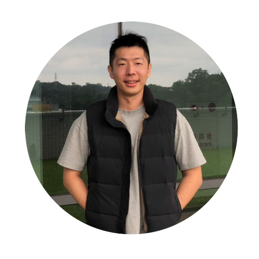

Title: About
Author: HsiaoEn

### 孫曉恩 (Sun, Hsiao-En)

現擔任台灣人工智慧學校技術發展處組長，主要負責AI技術的課程規劃與帶領學員進行AI專案實作。畢業於清大數學所，目前研究領域主要聚焦於 NLP。這邊是我的學習筆記，會分享一些AI的知識與技術。

喜愛研究技術，希望透過這部落格記錄我的學習心得，除理論知識外平時也喜歡透過實作來磨練技術，以讓自己持續保持技術能量。